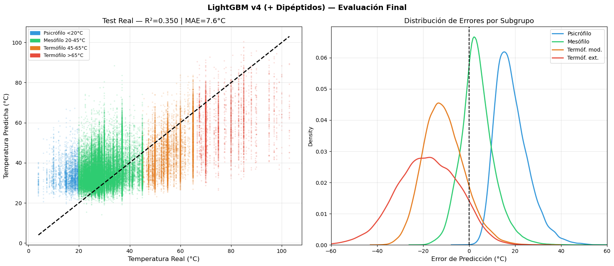
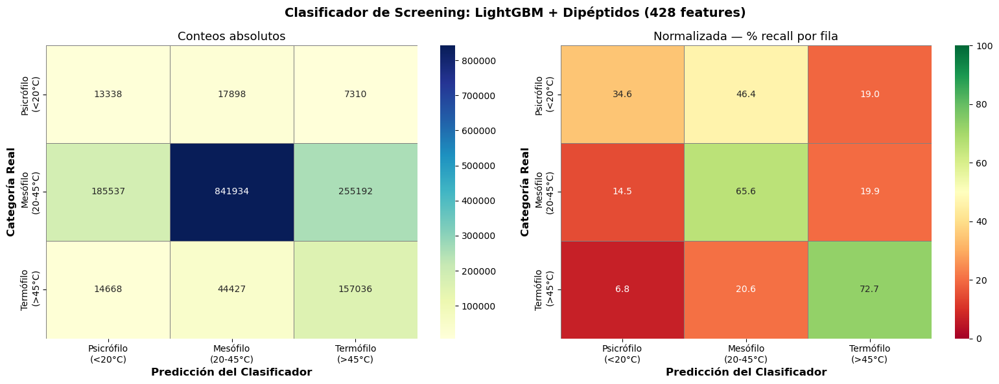

# ProteinTS

**Protein thermostability prediction from sequence composition using LightGBM on 7.7 million proteins**

[](https://www.python.org/)
[](https://lightgbm.readthedocs.io/)
[](https://scikit-learn.org/)
[](https://www.kaggle.com/)
[](LICENSE)

---

Thermostable enzymes — proteins from organisms that thrive above 45°C — are industrially valuable for biofuel production, detergent formulation, and pharmaceutical synthesis. This project predicts the **Optimal Growth Temperature (OGT)** of a protein's source organism directly from amino acid sequence composition, using a feature set of **428 biophysical descriptors** and training on **6.1 million sequences**.

Achieved **MAE 7.57°C** on a held-out test set of 1.5 million sequences — a 37% improvement over a mean-prediction baseline. R² of 0.35 matches the theoretical ceiling for composition-only models reported in the literature (Zeldovich et al., 2007; Engqvist, 2018).

---

## Scientific context

Predicting protein thermostability from sequence is a benchmark problem in computational biology. The OGT of a source organism is a meaningful proxy for the thermal adaptation encoded in its proteome. While structural features (H-bonds, salt bridges, hydrophobic core packing) are the proximate determinants of stability, they leave a detectable statistical signal in amino acid composition that classical ML can partially capture.

This project establishes the performance ceiling of **sequence-composition-only models** and characterizes where that ceiling lies — informing which additional features (ESM-2 embeddings, torsion autocorrelation, moment of hydrophobicity) are needed to push beyond R² ≈ 0.45.

---

## Dataset

**Source:** [Kaggle — Enzyme Thermostability](https://www.kaggle.com/)

| File | Shape | Description |
|---|---|---|
| `X_train.npy` | (6,149,359 × 650) | Integer-encoded sequences (0–20), zero-padded to length 650 |
| `y_train.npy` | (6,149,359,) | Source organism OGT in °C |
| `X_test.npy` | (1,537,340 × 650) | Evaluation sequences |
| `y_test.npy` | (1,537,340,) | Ground truth OGT for evaluation |

The OGT distribution is strongly right-skewed, reflecting the dominance of mesophilic organisms in sequence databases:

| Category | OGT range | Dataset fraction |
|---|---|---|
| Psychrophile | < 20°C | ~2.5% |
| Mesophile | 20–45°C | ~83% |
| Moderate thermophile | 45–65°C | ~10% |
| Extreme thermophile | > 65°C | ~4.5% |

This imbalance is addressed via sample weighting during training (see Model section).

---

## Feature engineering

**428 features** are extracted per protein, organized in three groups:

### 1. Amino acid frequencies (20 features)

Relative frequency of each of the 20 canonical amino acids. Classical basis for protein property prediction — thermophilic proteomes are enriched in charged residues (Lys, Arg, Glu) and depleted in thermolabile residues (Gln, Asn).

### 2. Derived biophysical properties (8 features)

| Feature | Description | Thermophilic direction |
|---|---|---|
| `GRAVY` | Kyte-Doolittle hydrophobicity index | More positive in thermophiles |
| `aromaticity` | % Phe + Tyr + Trp | Higher in thermophiles (π–π stacking) |
| `pct_Cys` | % Cysteine | Variable; disulfide bridges confer rigidity |
| `charge_pos` | % Lys + Arg | Higher in thermophiles |
| `charge_neg` | % Asp + Glu | Higher in thermophiles |
| `charge_balance` | charge_pos − charge_neg | Proxy for estimated isoelectric point |
| `pct_Pro` | % Proline | Higher in thermophiles (chain rigidification) |
| `log_length` | log(1 + sequence length) | Thermostable proteins tend to be more compact |

### 3. Dipeptide composition (400 features)

Relative frequency of all 20×20 = 400 consecutive amino acid pairs. Dipeptides capture local sequence order invisible to single amino acid frequencies and encode secondary structure tendencies (α-helix and β-sheet propensities are strongly dipeptide-dependent).

---

## Model

**Algorithm:** LightGBM (gradient boosting with compressed histograms)

Two models were trained on a 500,000-protein stratified sample with natural OGT distribution:

### OGT regressor

Predicts optimal growth temperature in °C.

```
Key hyperparameters:
  num_leaves:        127
  learning_rate:     0.05
  colsample_bytree:  0.4   (40% of 428 features sampled per tree)
  subsample:         0.8
  early_stopping:    80 rounds without validation improvement
```

Class imbalance is addressed with `sample_weight`:

| Subgroup | Weight |
|---|---|
| Extreme thermophiles (>65°C) | 6× |
| Moderate thermophiles (45–65°C) | 3× |
| Psychrophiles and mesophiles | 1× |

### Thermal class classifier

Assigns proteins to Psychrophile / Mesophile / Thermophile using `class_weight='balanced'`.

---

## Results

### Regressor — full test set (1,537,340 proteins)

| Metric | Value |
|---|---|
| **MAE** | **7.57°C** |
| **RMSE** | **10.23°C** |
| **R²** | **0.350** |



**Context:** A constant-prediction baseline (always predicting the mean OGT, ~35°C) would yield MAE ≈ 12°C and R² = 0. This model reduces MAE by 37% relative to that baseline. The R² of 0.35 is consistent with the theoretical ceiling for composition-only models: Zeldovich et al. (2007) and Engqvist (2018) both report R² ≈ 0.30–0.45 as the performance limit when using only amino acid composition to predict OGT, because OGT is a property of the **organism**, not the individual protein — two proteins from the same organism share OGT but have very different compositions.

### Per-subgroup breakdown — classifier

| Subgroup | N | MAE | Bias |
|---|---|---|---|
| Psychrophile (<20°C) | 38,546 | 18.65°C | +18.65°C (overestimation) |
| Mesophile (20–45°C) | 1,282,663 | 6.17°C | +3.69°C |
| Moderate thermophile (45–65°C) | 160,398 | 12.15°C | −10.90°C |
| Extreme thermophile (>65°C) | 55,733 | 18.99°C | −18.12°C |



The systematic bias at the extremes (psychrophiles overestimated, thermophiles underestimated) is expected: minority classes with unusual amino acid compositions are pulled toward the mesophilic majority by composition-only features. Overcoming this bias requires sequence-level embeddings (see Limitations).

---

## Limitations and roadmap

The compositional feature set has moderate but insufficient signal to separate extreme thermal classes. Exceeding R² ≈ 0.45 requires:

- **Sequence embeddings (ESM-2, ProtBERT):** Capture implicit 3D structural information from pre-trained protein language models
- **Selective trigrams:** Top ~50 trigrams most correlated with OGT, without the 8,000-feature curse of dimensionality
- **Hydrophobicity autocorrelation** at lags 3–4 (α-helix signature) and lag 2 (β-sheet)
- **Eisenberg hydrophobic moment:** Quantifies amphipathic helix asymmetry; distinguishes thermophilic amphipathic helices from mesophilic ones

---

## Repository structure

```
ProteinTS/
├── notebooks/
│   └── thermostability_pipeline.ipynb   # EDA and full pipeline development
├── src/
│   ├── features.py    # 428-feature extraction from encoded sequences
│   ├── train.py       # Regressor and classifier training
│   ├── evaluate.py    # Batch evaluation on test set
│   └── predict.py     # Inference on new sequences
├── models/            # Trained models (not included)
│   ├── regresor_ogt.txt
│   └── clasificador_ogt.txt
├── data/              # Dataset files (not included — download from Kaggle)
│   ├── X_train.npy
│   ├── y_train.npy
│   ├── X_test.npy
│   └── y_test.npy
├── images/            # Result plots
├── requirements.txt
└── README.md
```

---

## Installation and usage

```bash
# 1. Clone the repository
git clone https://github.com/CANOLIO/ProteinTS-DATASET.git
cd ProteinTS-DATASET

# 2. Install dependencies
pip install -r requirements.txt

# 3. Place dataset files in data/
# (download from Kaggle and move the .npy files to data/)

# 4. Train models
python src/train.py

# 5. Evaluate on the test set
python src/evaluate.py

# 6. Predict on new sequences
python src/predict.py --x data/X_test.npy --model models/regresor_ogt.txt
```

Custom data paths:

```bash
RUTA_X_TRAIN=/path/to/X_train.npy RUTA_Y_TRAIN=/path/to/y_train.npy python src/train.py
```

---

## References

- Zeldovich, K. B., et al. (2007). Protein and DNA sequence determinants of thermophilic adaptation. *PNAS, 104*(42), 16516–16521.
- Engqvist, M. K. M. (2018). Correlating enzyme annotations with a large set of microbial growth temperatures reveals metabolic adaptations to growth at diverse temperatures. *BMC Microbiology, 18*, 177.
- Kyte, J. & Doolittle, R. F. (1982). A simple method for displaying the hydropathic character of a protein. *Journal of Molecular Biology, 157*(1), 105–132.
- Ke, G., et al. (2017). LightGBM: A highly efficient gradient boosting decision tree. *NeurIPS*.

---

## Author

**Fabián Rojas** — Biochemist & Computational Biologist · Valdivia, Chile

[LinkedIn](https://www.linkedin.com/in/fabianrojasg/) · [GitHub](https://github.com/CANOLIO)

---

## License

MIT License — see [LICENSE](LICENSE) for details.
